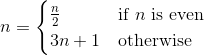

# Collatz

## Preface

A collatz sequence, starting with a positive integer*n*, is found by repeatedly applying the following function to *n* until *n* == 1 : 



```
n = { n / 2 for even n ;
        3n + 1 for odd n }
```
A more detailed description of the collatz conjecture may be found [on Wikipedia](http://en.wikipedia.org/wiki/Collatz_conjecture).
<br><br>

## The Problem

Create a function `collatz` that returns a collatz sequence string starting with the positive integer argument passed into the function, in the following form:

"X0->X1->...->XN"

Where Xi is each iteration of the sequence and N is the length of the sequence.

## Sample Input
```
collatz(4); // should return "4->2->1"
collatz(3); // should return "3->10->5->16->8->4->2->1"
```
Don't worry about invalid input. Arguments passed into the function are guaranteed to be valid integers >= 1.